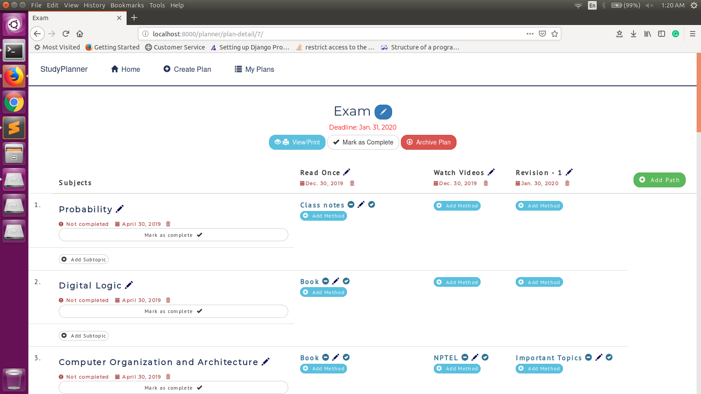

# Study Planner

### Steps to run the project
* Clone the project into your local machine
```
git clone "https://github.com/manjumbmb97/Study-Planner.git"
```
* Install the dependencies
```
pip install -r requirements.txt
```
* Make migrations
```
python manage.py makemigrations
```
* Migrate the migrations
```
python manage.py migrate
```
* Run the local django server
```
python manage.py runserver
```
* Browse to localhost:8000



